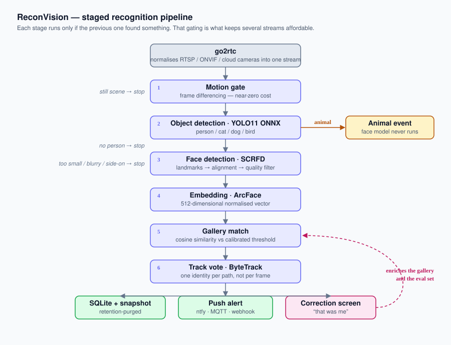

# ReconVision

Face recognition on home video streams. It watches your cameras and tells you whether
what just walked past is **you**, a **stranger**, or an **animal** — and pushes that to
your phone.



## What it does

- **Recognises known faces** using pre-trained ArcFace embeddings, not a model trained
  from scratch. Enrolling a person takes a handful of photos and about thirty seconds.
- **Filters out animals early.** A cat crossing the room is classified by the object
  detector and never reaches the face model, which is where the CPU budget goes.
- **Declines to guess.** A face too small, blurry or side-on to identify is reported as
  "someone was here" rather than matched against the gallery, because a degraded
  embedding lands near everybody and produces confident wrong answers.
- **Emits one event per passage, not one per frame.** Identity is decided by a
  quality-weighted vote across a tracked path, so a person walking through a room
  produces a single stable event instead of two hundred flickering ones.
- **Pushes alerts** to ntfy, MQTT / Home Assistant and generic webhooks, with a snapshot.
- **Gets better as you correct it.** Marking an event as "that was me" adds a real-world
  capture (night, infrared, off-angle) to the gallery and feeds the calibration set.
- **Runs entirely on your own hardware.** No image ever leaves the machine.

## How recognition works

Training a face recognition network from scratch takes millions of faces and weeks of
GPU time. ReconVision does not do that, and neither should you:

1. A pre-trained **ArcFace** model projects any face into a 512-dimensional vector.
2. You **enrol** a person from 10–20 photos; their vectors form a *gallery*.
3. At runtime, a detected face is compared to the gallery by **cosine similarity**.
   Above a calibrated threshold, it is a match.

The engineering that actually determines accuracy is not the model — it is threshold
calibration, face-quality filtering and temporal smoothing. `reconvision eval` measures
all of it and reports a number instead of a hunch.

## Requirements

- Python 3.12
- [uv](https://docs.astral.sh/uv/)
- Optionally [go2rtc](https://github.com/AlexxIT/go2rtc), which normalises almost any
  camera (RTSP, ONVIF, proprietary cloud cameras) into a single stream the pipeline can
  read. Recommended if you do not know whether your cameras expose RTSP.

## Installation

```bash
git clone https://github.com/supremjerem/reconvision.git
cd reconvision
uv sync --extra runtime --extra api --extra notify --extra telemetry --extra dev
cp .env.example .env                      # then edit it
cp cameras.example.yaml cameras.yaml      # then edit it
```

## Usage

```bash
# Once, after installing: download and convert the weights (~360 MB, into data/).
uv run reconvision export-models

# Check the configuration without opening a camera.
uv run reconvision check

# Teach the system a person. Every photo is reported individually; a photo with
# more than one face is skipped rather than guessed at.
uv run reconvision enroll --identity you --photos ./data/gallery/you

# Measure accuracy and get a threshold to put in .env. Do not guess this value.
uv run reconvision eval

# Watch a source. Animals are classified without any enrolment.
uv run reconvision run --source webcam:0 --name office
uv run reconvision run --source ./clip.mp4
```

### Choosing the threshold

`eval` compares many photographs of the same person against many photographs of
different people, and reports the threshold that holds wrong identifications to a
chosen rate. It measures against [LFW](http://vis-www.cs.umass.edu/lfw/) because a
false-accept rate of one in a thousand cannot be observed with the two or three people
in a household. The dataset is downloaded on demand into `data/` and never committed.

The output names the trade-off directly:

```
FAR    1.0%  ->  threshold 0.31  recognises 99% of genuine faces
FAR    0.1%  ->  threshold 0.42  recognises 96% of genuine faces
FAR   0.01%  ->  threshold 0.51  recognises 89% of genuine faces
```

Fix the false-accept rate first: it is how often a stranger is greeted by your name,
which in a house is the error that matters. How often the system recognises you follows
from that choice.

## Architecture

Hexagonal. The `domain` package holds the recognition rules and depends on nothing —
no OpenCV, no ONNX, no SQL, no web framework. Everything with an I/O boundary lives
behind a `Protocol` port in `domain/ports.py` and is implemented in `adapters/`.

That separation is not ceremony: it is why the domain test suite runs in under a second
with no model and no camera, and why swapping SQLite for PostgreSQL or ByteTrack for
another tracker touches one adapter instead of the pipeline.

| Layer | Responsibility |
|---|---|
| `domain/` | Matching, quality rules, temporal voting, port definitions. Pure. |
| `application/` | Pipeline orchestration, enrollment, feedback loop, evaluation, config. |
| `adapters/` | Video sources, ONNX detectors, InsightFace, tracking, SQLite, notifiers. |
| `api/` | FastAPI routes and the two HTMX screens. |

See [`docs/adr/`](docs/adr/) for the reasoning behind the significant decisions.

## Privacy

This repository is public; the data it processes is not, and must never be committed.

- All processing is local. No image, frame or embedding is sent anywhere.
- `data/` holds photos, snapshots, embeddings and the database, and is git-ignored.
- Camera URLs and credentials live in `.env`, referenced from `cameras.yaml` by variable.
- A pre-commit hook blocks images, databases, model weights and credentialed URLs.
- Snapshots are purged automatically according to `RECONVISION_SNAPSHOT_RETENTION_DAYS`.

Enrolling someone other than yourself requires their consent. Tell the other people in
your household that the system is running.

**Not an access control system.** There is no liveness detection: a printed photo held
up to the camera will be recognised. This is fine for household notifications and
unacceptable for anything that unlocks a door.

## Roadmap

- [x] **1. Scaffolding** — uv + Python 3.12, ruff, mypy strict, pytest, hardened
      `.gitignore`, leak-blocking pre-commit hook, GitHub repository, green CI
- [x] **2. Domain layer** — matching, quality filters, temporal voting, ports, unit tests
- [x] **3. Observability** — OpenTelemetry traces/metrics/logs and structlog, wired early
      so every later stage is instrumented as it is written
- [x] **4. Video ingestion** — file, webcam, RTSP and go2rtc sources, reconnection,
      frame dropping under load, motion gating
- [x] **5. Detection and recognition** — YOLO11 ONNX export, person/animal detection,
      InsightFace embeddings, ByteTrack, full pipeline
- [x] **6. Enrollment and calibration** — `enroll` and `eval` with ROC and TAR@FAR=1e-3
- [ ] **7. Persistence and alerts** — SQLite WAL, migrations, snapshot retention,
      ntfy / MQTT / webhook fan-out
- [ ] **8. Web screens** — enrollment review and event correction, feeding the gallery
      and the calibration set
- [ ] **9. Container and CD** — multi-arch images on GHCR, compose bundle with go2rtc,
      CodeQL, Dependabot, branch protection

## Development

```bash
uv run pytest                       # domain suite: fast, no models, no network
uv run pytest -m integration        # pipeline against synthetic video and fakes
uv run ruff check . && uv run mypy src
uv run pre-commit install           # enable the privacy guard locally
```

To view traces and metrics locally, start the bundled stack and point the exporter at
it — Grafana is then on <http://localhost:3000>:

```bash
docker compose -f docker/compose.observability.yml up -d
RECONVISION_TELEMETRY_EXPORTER=otlp uv run reconvision run --source webcam
```

Day-to-day work happens on `develop`; `main` is protected and only advances through
reviewed pull requests.

## License

MIT
